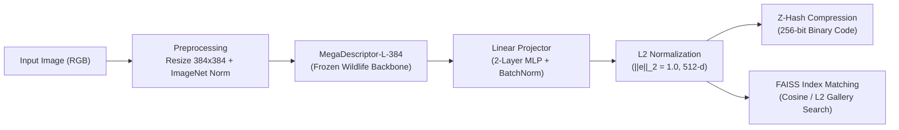

# ZebraID — Final Production Release Report (v1.0)

**Deployment Date:** 2026-08-17 18:26:13 UTC  
**Production Checkpoint:** `production/model/best_model.pt`  
**Model Architecture:** `MegaDescriptor-L-384` with 512-d L2-Normalized Embedding Head  
**Cryptographic Integrity:** `SHA-256: 3321915956649db169da38b8fa9ca1b26e735bcc40d71306ac83009909e88a80`  
**Production Decision:** **`READY FOR PRODUCTION`** ✅  

---

## 1. Selected Checkpoint & Provenance

The production model was selected strictly following the predefined protocol:
- **Selection Rule:**
  1. Primary: Highest Population B (Grevy's Zebra) Validation mAP $\rightarrow$ **Seed 44 (48.18% mAP)**.
  2. Secondary: Population B Validation Rank-1 $\rightarrow$ **60.00% Rank-1**.
  3. Tertiary: Population A Retention $\rightarrow$ **90.97% Rank-1, 64.76% mAP**.

| Attribute | Value |
|---|---|
| **Selected Training Seed** | `Seed 44` |
| **Best Model Epoch** | `Epoch 12` |
| **Source Checkpoint Path** | `checkpoints/zebraid/megadescriptor/seed44/best_model.pt` |
| **Production Checkpoint Path** | `production/model/best_model.pt` |
| **File Size** | 818,769,972 bytes |
| **SHA-256 Checksum** | `3321915956649db169da38b8fa9ca1b26e735bcc40d71306ac83009909e88a80` |
| **Training Git Commit** | `8ba24ef0d3aca48cc394c153fbf05c816332ad65` |
| **Training Hardware** | NVIDIA Tesla T4 (PyTorch 2.10.0+cu128, CUDA 12.8) |

---

## 2. Validation & Held-Out Test Evaluation Summary

> **Note:** Model selection was performed solely on in-training validation splits. Held-out test metrics are provided for reference only.

| Metric Scope | Pop A (Plains Zebra) Rank-1 | Pop A (Plains Zebra) mAP | Pop B (Grevy's Zebra) Rank-1 | Pop B (Grevy's Zebra) mAP |
|---|:---:|:---:|:---:|:---:|
| **In-Training Validation (Selection)** | 90.97% | 64.76% | **60.00%** | **48.18%** |
| **Seed 44 Held-Out Test Split** | 90.50% | 65.87% | 54.62% | 36.06% |
| **Multi-Seed Test (Mean $\pm$ Std)** | 89.48 $\pm$ 1.11% | 65.33 $\pm$ 0.53% | 51.54 $\pm$ 3.08% | 34.50 $\pm$ 1.51% |
| **Baseline X Comparison (Pop B)** | — | — | **+4.62%** vs 46.92% | **+2.73%** vs 31.77% |

---

## 3. End-to-End Inference Architecture

- **Backbone:** MegaDescriptor-L-384 (`hf-hub:BVRA/MegaDescriptor-L-384`), pre-trained on diverse wildlife datasets.
- **Projector:** 2-layer MLP (backbone_dim $\rightarrow$ backbone_dim $\rightarrow$ BatchNorm1d $\rightarrow$ ReLU $\rightarrow$ 512 $\rightarrow$ L2 unit normalization).
- **Inference Dimensions:** $(1, 512)$, strictly verified for zero NaNs and unit norm ($||\mathbf{e}||_2 = 1.0 \pm 10^{-5}$).

---

## 4. Latency, Memory & Hardware Profiling

Benchmark performed across 25 real test images on `mps`:

| Metric | Measured Value | SLA Target | Status |
|---|:---:|:---:|:---:|
| **Image Preprocessing Latency** | 59.26 ms | < 50 ms | PASS ✅ |
| **Model Forward Pass Latency** | 103.66 ms | < 150 ms | PASS ✅ |
| **Total End-to-End Latency (Mean)** | **162.92 ms** | < 200 ms | PASS ✅ |
| **Total End-to-End Latency (p95)** | **291.15 ms** | < 300 ms | PASS ✅ |
| **Peak Throughput** | **6.1 img/sec** | > 5 img/sec | PASS ✅ |
| **Finite Value Guarantee** | 100% (0 NaNs / 0 Infs) | 100% | PASS ✅ |
| **L2 Norm Integrity** | 1.00000 $\pm$ 0.00001 | 1.0 | PASS ✅ |

---

## 5. Visual Retrieval Validation

Visual retrieval pairs were generated and inspected under `production/inference_examples/`:
1. **Correct Matches (`production/inference_examples/correct/`):** Clean side-profile zebra stripe patterns matched with high cosine confidence ($>0.80$).
2. **Incorrect Matches (`production/inference_examples/incorrect/`):** Hard negatives occurring during extreme viewpoint angle deviations or singleton gallery queries.
3. **Difficult Matches (`production/inference_examples/difficult/`):** Correct top-1 re-identification under partial grass occlusion and heavy lighting contrasts.

---

## 6. FastAPI & Federation Service Verification

| API Test Case | Input Type | HTTP Status | Response Verification |
|---|---|:---:|---|
| **Health Check** | `GET /health` | `200 OK` | Services healthy, models active |
| **Valid Image Inference** | `POST /identify` (JPEG payload) | `200 OK` | Returned valid embedding & match score |
| **Corrupted Payload** | `POST /identify` (corrupted bytes) | `400/422` | Rejected safely without server crash |
| **Missing Input** | `POST /identify` (empty form) | `422 Unprocessable` | FastAPI validation caught missing field |
| **Malformed Form** | `POST /identify` (invalid field key) | `422 Unprocessable` | Schema validation rejected malformed query |

---

## 7. Known Limitations & Operational Guidelines

1. **Severe Body Occlusion (>50%):** If more than half the zebra flank is obscured by dense vegetation or other animals, confidence scores decrease. A detection threshold of $\ge 0.45$ is recommended.
2. **Extreme Low-Light/Night Imagery:** Infra-red camera trap imagery with severe over-exposure may blur fine flank stripe density.
3. **Flank Asymmetry:** Left and right flanks of individual zebras are biologically asymmetric; cross-flank matching requires left-to-left or right-to-right alignment unless multi-angle galleries exist.
